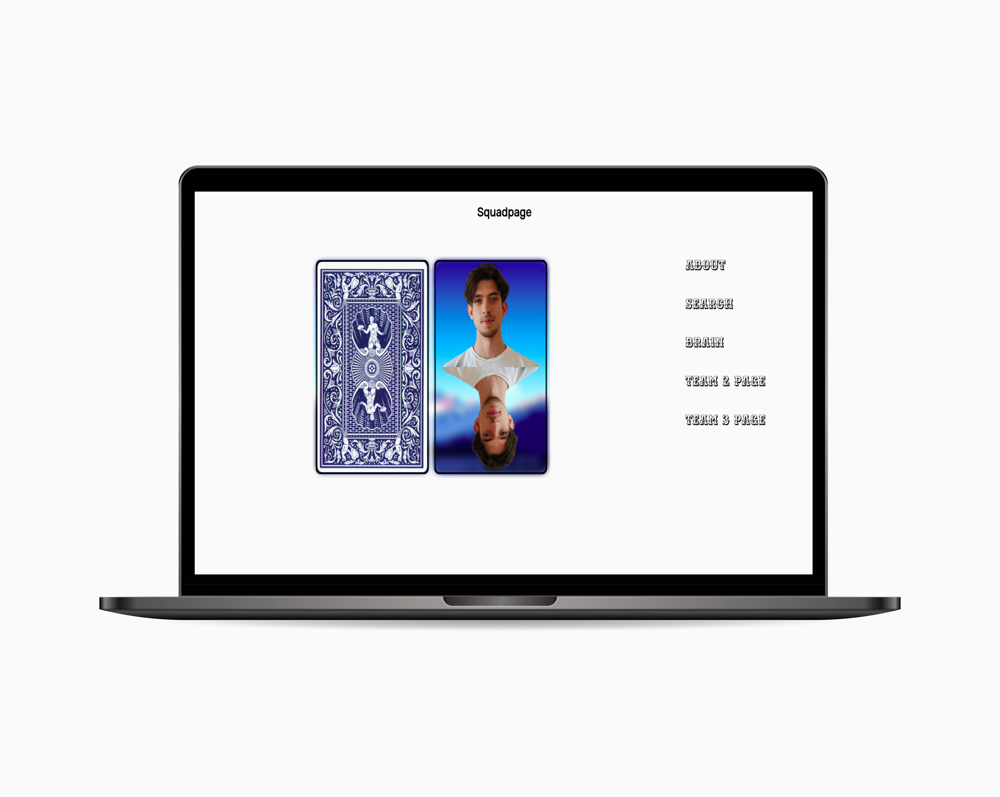

# Squadpage Bra1n




Om alle visitekaartjes van iedereen uit onze klas samen te brengen moesten wij een squadpage maken met iedereen van onze klas. Wij als team Bra1n hebben gekozen voor een stapel kaarten met iedereen als een appart kaartje.

## Inhoudsopgave
  * [Installatie](#installatie)
  * [Bronnen](#bronnen)
  * [Licentie](#licentie)

## Installatie
```
git clone https://github.com/DaanKorver/fdnd-squad-page-bra1n.git

cd fdnd-squad-page-bra1n
```

## Bronnen

* Alle visite kaartjes van FDND klas 1
* Beau, Daan, Jean, Yasser en Armando

## Licentie


This work is licensed under [GNU GPLv3](./LICENSE).

